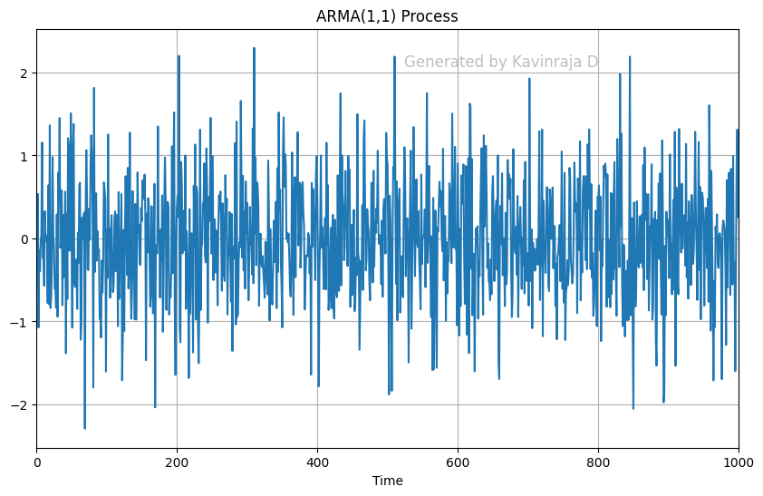
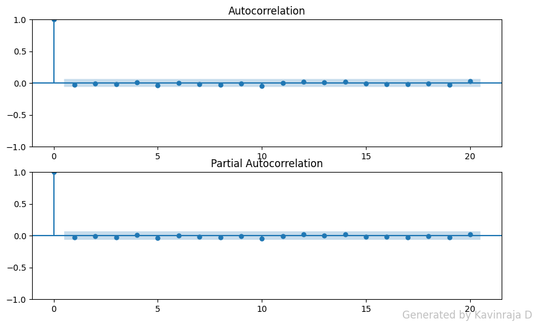
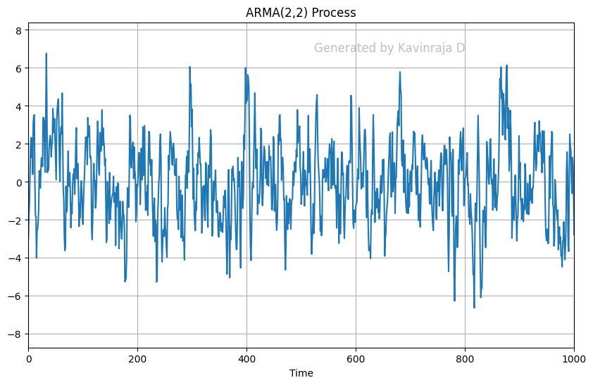
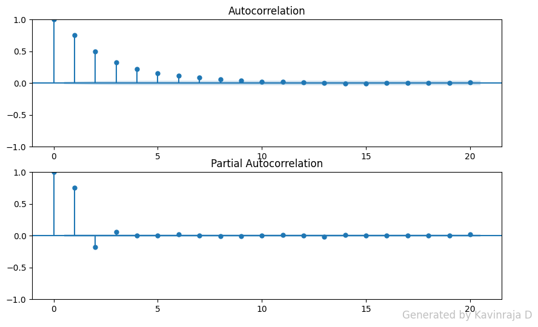

# Ex.No:04   FIT ARMA MODEL FOR TIME SERIES
# Date: 
### AIM:
To implement ARMA model in python.
### ALGORITHM:
1. Import necessary libraries.
2. Set up matplotlib settings for figure size.
3. Define an ARMA(1,1) process with coefficients ar1 and ma1, and generate a sample of 1000

data points using the ArmaProcess class. Plot the generated time series and set the title and x-
axis limits.

4. Display the autocorrelation and partial autocorrelation plots for the ARMA(1,1) process using
plot_acf and plot_pacf.
5. Define an ARMA(2,2) process with coefficients ar2 and ma2, and generate a sample of 10000

data points using the ArmaProcess class. Plot the generated time series and set the title and x-
axis limits.

6. Display the autocorrelation and partial autocorrelation plots for the ARMA(2,2) process using
plot_acf and plot_pacf.
### PROGRAM:
```py
### Name : Kavinraja D
### Regno: 212222240047
import numpy as np
import matplotlib.pyplot as plt
from statsmodels.tsa.arima_process import ArmaProcess
from statsmodels.graphics.tsaplots import plot_acf, plot_pacf

# Set up matplotlib settings for figure size
plt.rcParams['figure.figsize'] = [10, 6]

# Define ARMA(1,1) process
ar1 = np.array([0.7])
ma1 = np.array([0.5])
arma1_process = ArmaProcess(ar1, ma1)
arma1_sample = arma1_process.generate_sample(nsample=1000)

# Plot generated time series
plt.figure()
plt.plot(arma1_sample)
plt.title('ARMA(1,1) Process')
plt.xlim(0, 1000)
plt.xlabel('Time')
plt.show()

# Display autocorrelation and partial autocorrelation plots for ARMA(1,1)
fig, ax = plt.subplots(2, 1, figsize=(10, 6))
plot_acf(arma1_sample, ax=ax[0], lags=20)
plot_pacf(arma1_sample, ax=ax[1], lags=20)
plt.show()

# Define ARMA(2,2) process
ar2 = np.array([0.3, -0.2])
ma2 = np.array([0.4, 0.1])
arma2_process = ArmaProcess(ar2, ma2)
arma2_sample = arma2_process.generate_sample(nsample=10000)

# Plot generated time series
plt.figure()
plt.plot(arma2_sample)
plt.title('ARMA(2,2) Process')
plt.xlim(0, 1000)
plt.xlabel('Time')
plt.show()

# Display autocorrelation and partial autocorrelation plots for ARMA(2,2)
fig, ax = plt.subplots(2, 1, figsize=(10, 6))
plot_acf(arma2_sample, ax=ax[0], lags=20)
plot_pacf(arma2_sample, ax=ax[1], lags=20)
plt.show()

```
### OUTPUT:





### RESULT:
Thus, a python program is created to fir ARMA Model successfully.
